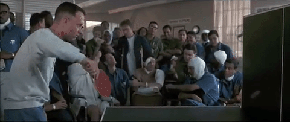

# Ping-Pong

# Contents

[1. Data Collection](#Data-Collection)\
[2. Data Cleaning](#Data-Cleaning)\
[3. Data Validation](#Data-Validation)\
[4. Modeling](#Modeling)\
[5. Games](#Games)

# [1. Data Collection](Data_Collection/)

Two data sources used in this project:
- <a href="https://lab.osai.ai/">OpenTTGames Dataset</a>: an open online dataset of ping pong gameplay shot at 120 frames per second.
- Videos I have personally taken with my iPhone 13, also recorded at 120 frames per second.

In both cases I label these videos using <a href="https://labelbox.com/">LabelBox</a>, an online data annotation tool. LabelBox limits the size of videos that can be uploaded, so I use split_videos.py to split them up into smaller videos that can be uploaded. After labeling the videos, I download the labels using download_labels.py.

# [2. Data Cleaning](Data_Cleaning/)

# [3. Data Validation](Data_Validation/)

I wrote the following data validation scripts to make sure the data collection and cleaning went as planned:
- data_val_parent.py includes shared code between data validation files
- save_events.py creates a video of only the events from a video
- show_labels.py annotates the input video with its table/ball/event labels

# [4. Modeling](Modeling/)

Four models are trained in this project:
- Ball Present: predicting whether the ball is present in the current frame or not
- Ball Location: predicting the ball's location (given that it's in the frame)
- Table Detection: locating the four corners of the table
- Event Detection: identifying when an event occurs (serve, bounce, paddle hit, net hit)

# [5. Games](Games/)

I have used the trained models to create two games. 

## Classic Ping Pong
The first is a simple game of ping pong. The four models are sufficient to score a true game of ping pong. Each point begins when a serve is detected, and continues until a rule is broken:
- double bounce
- net hit
- ball misses the table
- double paddle hit
- ball hit out of the air

Once a rule is broken, the point is over and one player is awarded a point.

## Coffin Corner Challenge
The second game is the "Coffin Corner Challenge", in which players earn points by hitting the ball as close to the corners as possible.
