# Ping Pong Referee and Training Games

GIF of a bunch of annotations over gameplay

## Contents
<!-- 
Intro
- loosely inspired by ttnet
- general flow of the project
Data Collection
- openttgames videos
- my own videos
Data Cleaning
- mov to mp4
- frame folders
Table Detection
- UNet architecture
- input/output
- augmentation/data cleaning
- training strategy/performance
Ball Detection
- go through the phases in the parent class
Event Detection
- bounces occur when ball goes down, up
- hits occur when ball goes left,right or right,left
Referee
- explain rules of ping pong and how parent info is enough to ref
Coffin Corner Challenge
- uses bounces to give players points
 -->

[1. Intro](#Intro)\
[2. Data Collection](#Data-Collection)\
[3. Data Cleaning](#Data-Cleaning)\
[4. Table Detection](#Table-Detection)\
[5. Ball Detection](#Ball-Detection)\
[6. Event Detection](#Event-Detection)\
[7. Referee](#Referee)\
[8. Coffin Corner Challenge](#Coffin-Corner-Challenge)

## [1. Intro](/Intro/)
This project analyzes ping pong games from scratch by locating the table, tracking the ball, and detecting events.
This data can be used to referee a ping pong game and create other training games.

The rest of this README walks through the data collection and cleaning, the steps to locate the table/ball/events, and how that data is used by the referee and training games.

## [2. Data Collection](/Data_Collection/)
I used two data sources in this project:
- <a href="https://lab.osai.ai/">OpenTTGames Dataset</a>: an open online dataset of ping pong games shot at 120 frames per second
(script to download this is [download_data.py](/Data_Collection/download_data.py))
- Videos I have personally taken with my iPhone 13, also recorded at 120 frames per second

## [3. Data Cleaning](/Data_Cleaning/)
In order to train the table detection model faster, I use [frame_folders.py](/Data_Cleaning/frame_folders.py) to save off relevant frames from each video into separate folders.
This way, I can efficiently load only the frames I need for training.

Additionally, I use [mov_to_mp4.py](/Data_Cleaning/mov_to_mp4.py) to convert iPhone videos from MOV to MP4 format.

## [4. Table Detection](/Table_Detection/)
The first step in analyzing ping pong gameplay is to find the table.
We need to know where the table is in order to detect bounces and map them to a shot chart.

To do this, I used a UNet Semantic Segmentation model that identifies every pixel in an input image that belongs to the table.

((((Side by side images of a real frame and a table mask))))

Regular frames from the ping pong game are sent to the model, and the output is a black image with white pixels where the table is.

(((( details about the training process, the file to train, evaluation, and perhaps a screenshot of the weights and biases charts))))

Once this output is created, I use opencv to find the 4 contours, or corners of the table.

((( picture of a table mask with circles on the four corners )))

## [5. Ball Detection](/Ball_Detection/)
#### Experiments
Detecting the ball was the biggest challenge.
It's very small and is always moving.

The TTNet paper proposed a method of predicting the probability of the ball being present at each x-y pixel value, but that proved to be inaccurate and needlessly complicated.

I also considered standard object detection methods, but they also had a hard time finding a small and often blurry ball in a large frame.

#### Background Subtraction
I found the best method of ball tracking was to use a background subtraction method.
By looking at the difference between two consecutive frames, I could easily locate moving objects, and determine which ones are the ball.

These are two consecutive frames from one of the videos and their difference:

  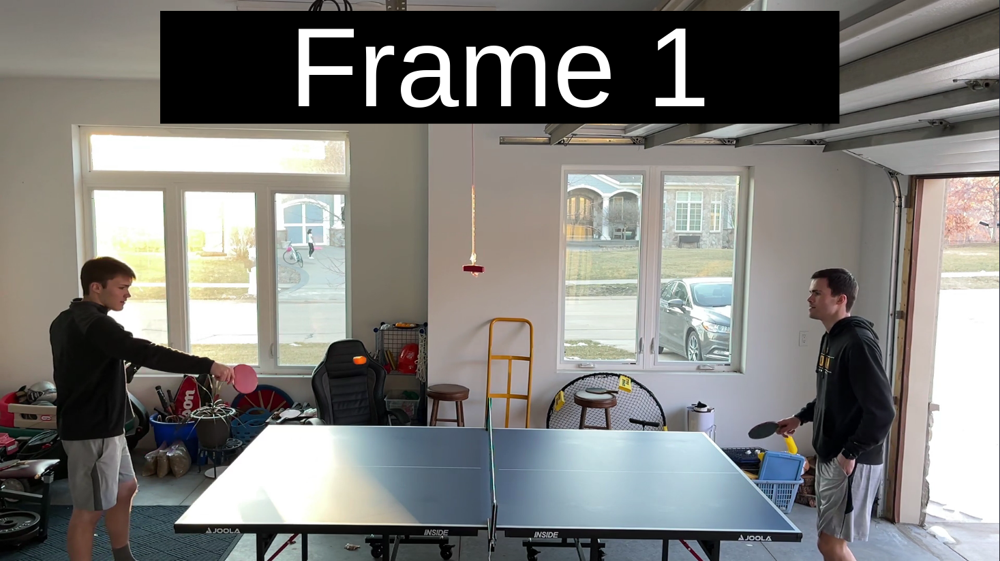
  
  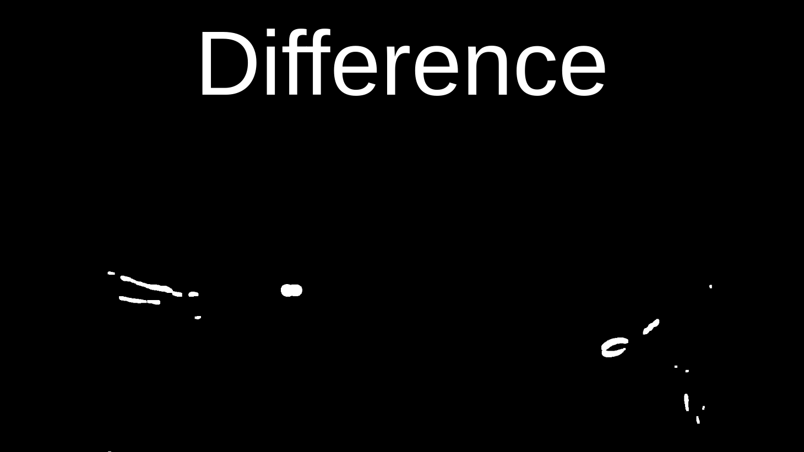

The frames look almost identical, but difference shows some small movement.

This quickly simplifies a noisy frame into small moving shapes.

#### Ball Detection - Phase 1
<!-- classic, neighbor, backtracked -->
Now that we've used background subtraction, only the players and ball are visible.
The only task left is to distinguish the ball apart from the players.
Using OpenCV, I detect all the contours (shapes) in the background-subtracted image like this:

  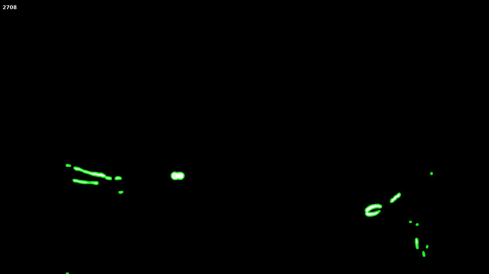

The next task is programatically determining which contour is the ball, if any.

  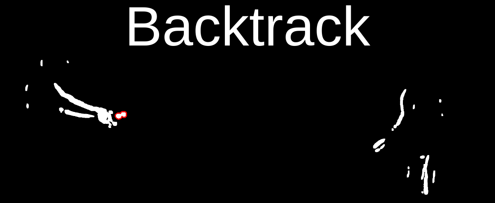
  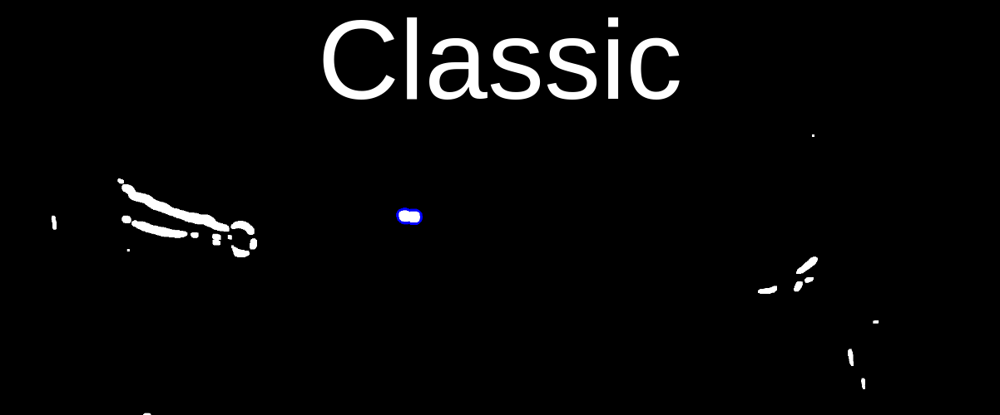
  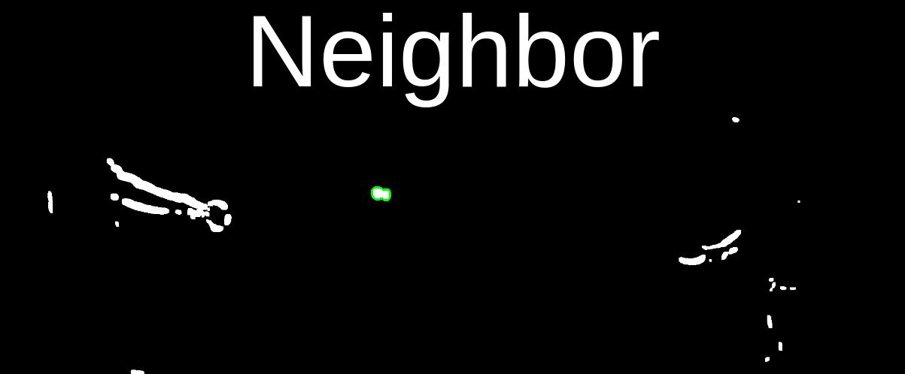

##### Find Ball - Classic
First, I locate the ball when its contour is above the middle of the table and far away from the two players.

This way, I am certain that the contour I detect is the ball, and not a moving player.

##### Find Ball - Neighbor
Once the ball is found using the classic method, I search the next frame for a nearby contour with the same shape.

This strategy allows us to simply follow the ball until it's hit by the player or no longer visible.

##### Find Ball - Backtrack
The final way I find the ball in phase 1 is with backtracking. 
Once the ball is found using the "classic" method where we're certain we found the ball, backtracking uses the neighbor method in reverse.
It looks for the nearby ball contours in previous frames until it's hit by a player or no longer visible.

This gif shows frames in which the ball is found with backtracking (red), the classic method (blue), and the neighbor method (green):

  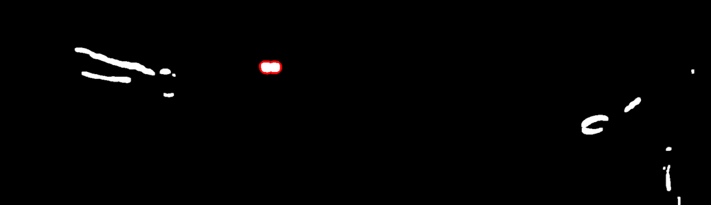

#### Ball Detection - Phase 2
The second phase of detecting the ball is centered around cleaning the ball contours to be more accurate and identifying the arcs that the ball travels.

##### Detect Bounces
First, I detect bounces using the (non-cleaned) ball detections I have so far.

A bounce occurs when the ball is decreasing for 5/7 frames, then increases for 5/7 frames.
I don't require 7 consecutive decreasing/increasing frames due to noise in the contours.

I need to know when bounces occur, because I want to ignore the contours near the bounce.
When the ball is very close to the table, the ball's shadow appears on the table, causing more contours like this:

  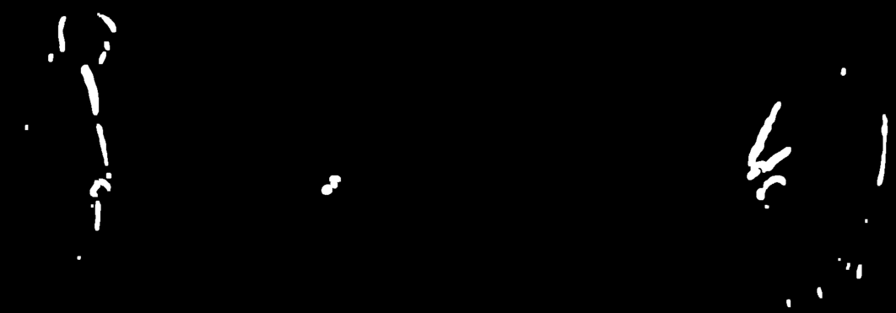
  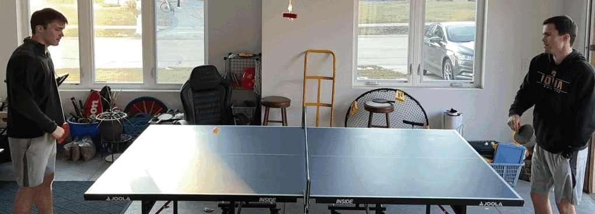

It's very difficult to tell which part of those contours are the ball, so I ignore them in this stage.
The ball location during bounces will be estimated in phase 3.

##### Clean Ball Contours
Next, I clean the ball contours so their centers reflect the ball's true position.

The ball's contour usually appears as two circles in an "8" shape, rather than just one ball.
That's because the pixels where the ball moved to changed, as well as the pixels where the ball was before.

  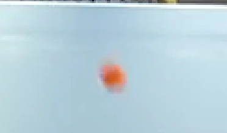
  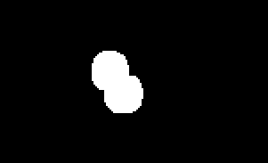

Fortunately, I can tell which circle is the ball based on its direction.
The real ball is always leading, so if the ball is moving right, it's the right circle and vice versa.

Once I know which circle I want to keep, I'll separate the circles by the pinch in the middle.
To do this I use opencv to approximate the shape of the ball with a set of points, then look for two close points that aren't next to each other along the border.

  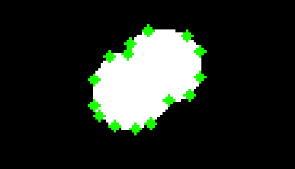
  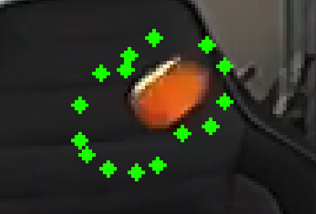
  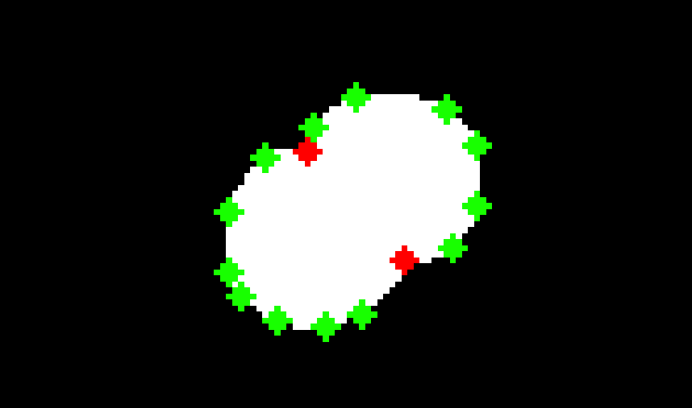
  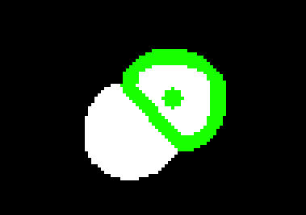
  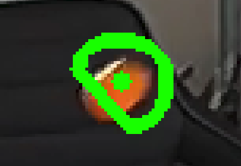

Once those two "middle points" are identified, I'll reapproximate the ball using only the points on one side of them:

  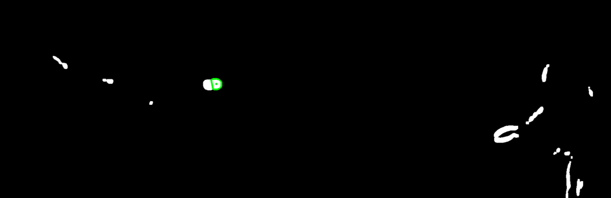

Now we're accurately tracking the ball!

#### Ball Detection - Phase 3
Phase 3 uses the ball detections we're confident in to predict where the ball is in situations where we aren't as confident, like hits and bounces.

##### Detect Arcs
First, we'll detect "arcs", which are paths the ball travels between events like serves, hits, bounces, and net hits.

To do this, I just make lists of frames where the ball is moving the same direction.
For instance, when the ball changes from moving right to left, we know the ball was hit and it's time to start a new arc.

Here's an example of the ball centers being shown in an arc:

  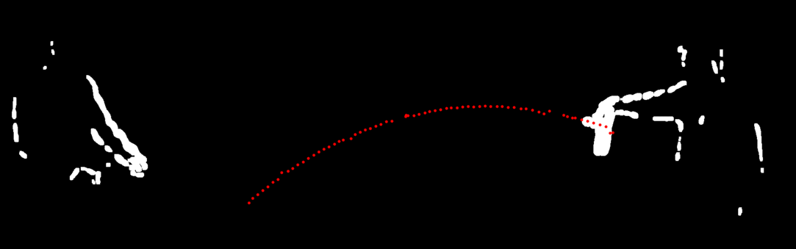

##### Interpolate Ball During Events
Recall that I did not attempt to locate the ball during bounces because its shadow produced many additional contours.
The ball is also not detected during hits because it's either not visible or its contour is merged with a players'.

To find the ball in these situations, I use the arcs from the last section to approximate where the ball is.
I do this by fitting a 2-degree polynomial to the points in each arc, and extending them out where the ball wasn't detected.

Here's an example of two arcs separated by a bounce:

  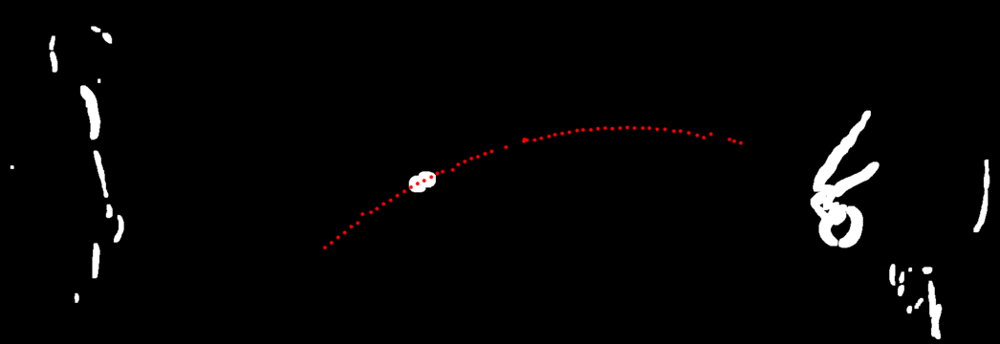

The frames around the bounce are missing, so the polynomials are used to approximate the gap like this:

  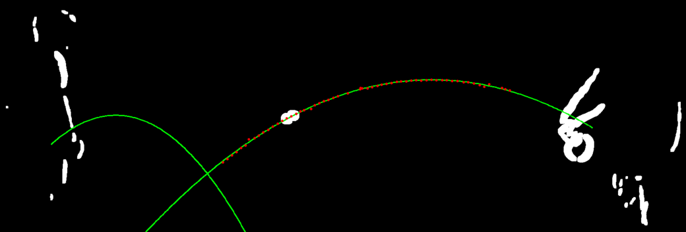

Now we can easily tell where the ball is during bounces with messy contours!

The same idea is used for hits:

  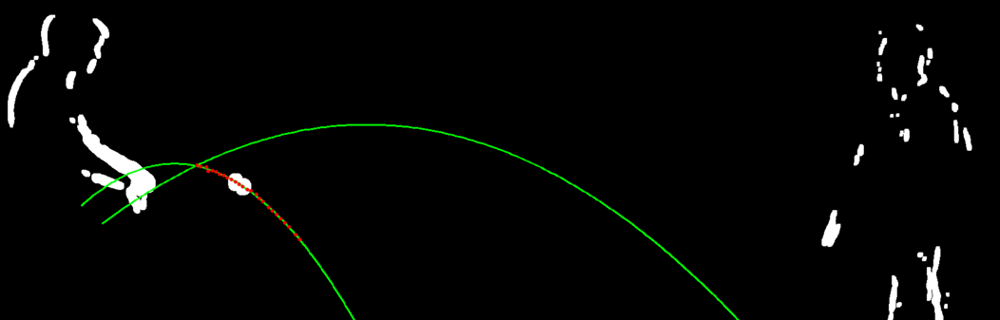

##### Interpolate Ball Within Arcs
Sometimes it's hard to identify the ball, especially when it's moving very fast.
When that happens, I'll use the fitted polynomials to approximate the ball's location within an arc too.

## [6. Event Detection](/Event_Detection/)
Once we know where the ball is at all times, detecting events becomes easy.

#### Bounces
Bounces occur when the ball's height decreases for 5/7 frames, then increases for 5/7 frames.
The bounce also must occur within the table area found earlier in part 4.

#### Hits
Hits occur when the ball changes direction horizontally, away from the center of the table.

#### Net Hits
I define a "net hit" as any time the ball touches the net, whether it goes over or not.

The background subtraction setup makes this easy, since the net moves every time the ball touches it:

  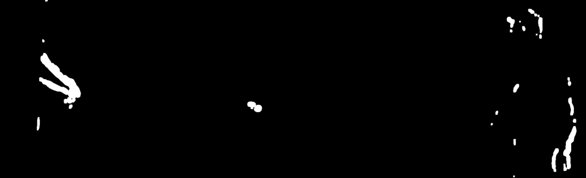

All it takes to detect the net hit here is to look for repeated, tall contours near the center of the table.

## [7. Referee](/Referee/)

  

## [8. Coffin Corner Challenge](/Coffin-Corner-Challenge/)
